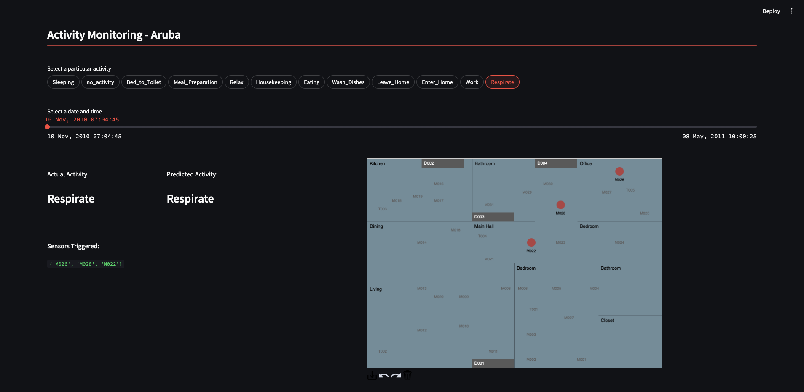

## Human Activity Recognition (HAR) System Demo

<br/>

#### Overview
This repository contains a demo of a Human Activity Recognition (HAR) system using the CASAS Smart Home Data Set - Dataset 17. The purpose of this system is to classify and recognize the activities performed by a volunteer in a smart home environment, using sensor data. The dataset includes sensor readings and corresponding activity labels (e.g., Meal_Preparation, Wash_Dishes, etc.) collected from a smart home environment.

<br/>
<div align="center" style="flex-direction: column;">
  
  <div style="font-size: 0.8em; color: gray;">Demo UI</div>
</div>

<br/>

The system is designed to process and analyze the sensor data to predict and recognize human activities based on the sensor readings over time. This demo highlights how HAR can be used in real-world applications such as smart homes, health monitoring, and context-aware computing.

<br/>


### 📋 Requirements
To run this project by yourself, you need:
- Python 3.7+

Install the dependencies with:

```bash
pip install -r requirements.txt
```
