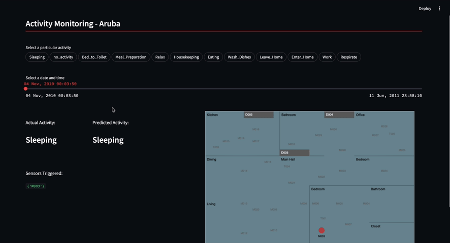

## Human Activity Recognition (HAR) System Demo

#### Overview

<p style="text-align: justify;">
This repository contains a demo of a Human Activity Recognition (HAR) system using XGBoost for the CASAS Smart Home Data Set - Dataset 17. The purpose of this system is to classify and recognize the activities performed by a volunteer in a smart home environment, using sensor data. The dataset includes sensor readings and corresponding activity labels (e.g., Meal_Preparation, Wash_Dishes, etc.) collected from a smart home environment.
</p>

<br/>
<div align="center" style="flex-direction: column;">
  
  <div style="font-size: 0.8em; color: gray;">Demo UI</div>
</div>

<br/>


<p style="text-align: justify;">
The system is designed to process and analyze the sensor data to predict and recognize human activities based on the sensor readings over time. This demo highlights how HAR can be used in real-world applications such as smart homes, health monitoring, and context-aware computing.
</p>

<br/>


## 📊 Dataset

Dataset is available at [CASAS Smart Home Data Set - Dataset 17](https://casas.wsu.edu/datasets/aruba.zip). The dataset contains sensor readings and corresponding activity labels collected from a smart home environment. The activities include:
- Relax (2910)
- Meal_Preparation (1606)
- Enter_Home (431)
- Leave_Home (431)
- Sleeping (401)
- Eating (257)
- Work (171)
- Bed_to_Toilet (157)
- Wash_Dishes (65)
- Housekeeping (33)

<small> Note: The data is not added in the repository due to its size. You can download it from the CASAS website and place the `data.txt` file in the `aruba` folder.</small>

<br/>


### 📋 Requirements
To run this project by yourself, you need:
- Python 3.7+

Install the dependencies with:

```bash
pip install -r requirements.txt
```


<br>

## 🖥️ Usage

1. Download the dataset from [CASAS Smart Home Data Set - Dataset 17](https://casas.wsu.edu/datasets/aruba.zip).
2. Unzip the downloaded file and place the `data.txt` file in the `aruba` folder.
3. Run the `model.ipynb` file  followed by the `process.ipynb` file to train the model and process the data. The trained model will be saved as `model.pkl`.
4. Move the `normalized_data.csv` and `time_series_data.csv` files to the `data` folder.
5. Replace the `model.pkl` file in the `data` folder with the one generated in step 3.
6. Run the following command to start the Streamlit server:
```bash
streamlit run Home.py
```